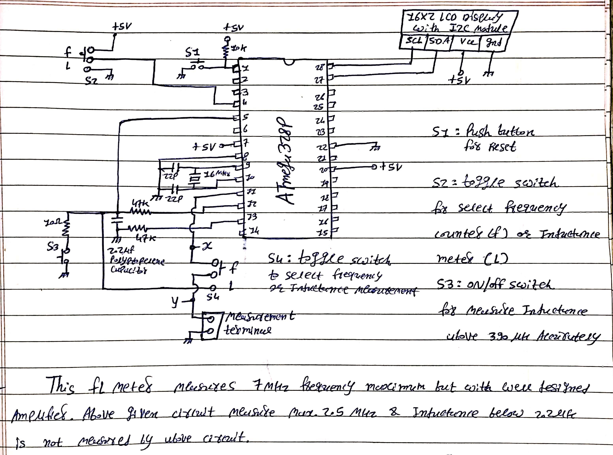
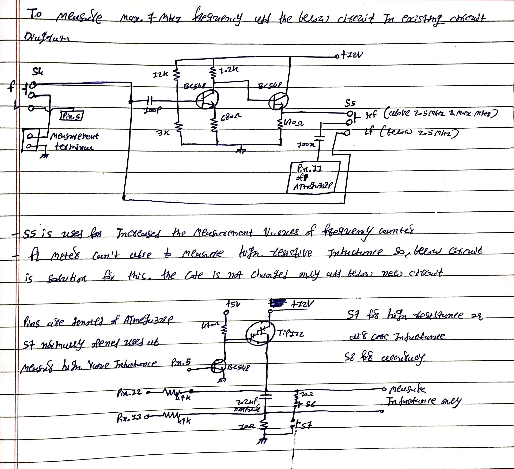

# FL-meter
# FL Meter (Frequency Counter & Inductance Meter)

This Arduino-based **FL Meter** project is designed to measure **frequency** up to **7 MHz** and **inductance**, including both low and high resistive inductors. The project includes circuit diagrams and Arduino code to implement and extend the functionality.

## Overview

The FL Meter combines two functions:
- **F (Frequency Counter)** – Measures frequency signals.
- **L (Inductance Meter)** – Measures the inductance of coils and inductors.

This project is implemented using an **Atmega328P microcontroller** and a **16x2 LCD with I2C interface** for display.

---

## Features

- Frequency measurement up to **7 MHz**
- Inductance measurement (accurate for values **above 2.2µH**)
- Advanced mode to measure **high-resistive inductors**
- Selectable operation mode using toggle and push switches
- Readable display using 16x2 I2C LCD
- Fully Arduino-compatible (.ino code included)

---

## Circuit Description

### 1. Base FL Meter Circuit

This is the initial circuit used to measure frequency and inductance:

- Measures frequency up to **2.5 MHz**
- Accurately measures inductance above **2.2µH**
- Uses Atmega328P for processing
- Displays readings on a 16x2 I2C LCD

**Circuit Diagram:**

---

### 2. Extended Circuit with Amplifier

This circuit adds an **amplifier stage** to increase signal strength and measurement accuracy:

- Amplifier built using **BC547/BC548 transistors**
- Frequency measurement improved up to **7 MHz**
- Accurate inductance measurement for **both low and high resistive inductors**
- Connects to the base FL meter for extended functionality

**Circuit Diagram:**

---

## How It Works

- **S1–S5**: Toggle/push switches for function selection
- **LCD**: Displays frequency or inductance
- **Measurement Terminals**: Connect the signal source or inductor

---

## Specifications

| Parameter              | Value                        |
|------------------------|------------------------------|
| Microcontroller        | Atmega328P                   |
| Display                | 16x2 LCD with I2C module     |
| Frequency Range        | Up to 7 MHz                  |
| Inductance Range       | ≥ 2.2 µH (accurate)          |
| Power Supply           | +5V (Logic), +12V (Amplifier)|
| Accuracy               | Moderate (depends on calibration) |
| Max Input Frequency    | ~7.5 MHz (AVR Limit)         |

---

## Applications

- DIY Electronics Lab Tools
- RF Circuit Development
- Inductor Testing
- Educational Projects
- Ham Radio Applications
- Component Characterization

---

## Limitations

- AVR-based microcontrollers (like Atmega328P) have limited frequency counting abilities above ~7.5 MHz
- Cannot measure inductance below ~2.2 µH accurately using the base circuit
- Requires calibration for best results
- Sensitive to surrounding electrical noise (shielding recommended)

---

## Advantages

- Simple and low-cost
- Works with common Arduino hardware
- Extendable for more accuracy
- Useful for both beginners and advanced hobbyists
- Portable and customizable

---

## Folder Contents

- `FL_meter.ino` – Main Arduino sketch for FL Meter
- `Circuit_Diagram_1.jpg` – Base circuit schematic
- `Circuit_Diagram_2.jpg` – Extended amplifier circuit
- `README.md` – This file

---

## How to Use

1. Upload `FL_meter.ino` to your Arduino board.
2. Connect the circuit as per the schematics provided.
3. Use toggle switches to select measurement mode.
4. Connect signal or inductor to measurement terminals.
5. Read values on the LCD screen.

---

## Future Improvements

- Add auto-calibration functionality
- Use faster microcontroller (like STM32 or ESP32) for higher frequency range
- Add data logging via SD card or serial interface
- Implement digital filtering for stable readings

---

## License

This project is open-source and available under the [MIT License](LICENSE).
